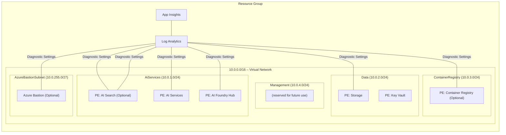

# Architecture

This document describes the Azure resources deployed by [infra/main.bicep](infra/main.bicep), the Azure Verified Modules (AVM) used, and the network topology when deployed with network isolation.

If this solution accelerator is deployed without network isolation, the networking resources are not deployed and public endpoints are enabled for all PaaS services.

## Zero-trust with Network Isolation

The following diagram illustrates the architecture of the Azure resources deployed when network isolation is enabled. The solution accelerator is deployed in a single resource group, and all resources are deployed in a single virtual network with private endpoints. The virtual network is segmented into multiple subnets to enable granular network security and future scalability.

### Zero-trust high‑Level Architecture

| Layer                   | Resource                                 | AVM Reference                                                                                                                                        |
|-------------------------|------------------------------------------|------------------------------------------------------------------------------------------------------------------------------------------------------|
| Management & Monitoring | Log Analytics Workspace                  | [avm/res/operational-insights/workspace](https://github.com/Azure/bicep-registry-modules/tree/main/modules/operational-insights/workspace)           |
|                         | Application Insights                     | [avm/res/insights/component](https://github.com/Azure/bicep-registry-modules/tree/main/modules/insights/component)                                   |
| Core Networking         | Virtual Network                          | [avm/res/network/virtual-network](https://github.com/Azure/bicep-registry-modules/tree/main/modules/network/virtual-network)                         |
|                         | Private DNS Zones (Key Vault, Storage, Container Registry, AI Search, AI Services, Foundry Hub) | [avm/res/network/private-dns-zone](https://github.com/Azure/bicep-registry-modules/tree/main/modules/network/private-dns-zone) |
| Security                | Azure Key Vault (PE)                     | [avm/res/key-vault/vault](https://github.com/Azure/bicep-registry-modules/tree/main/modules/key-vault/vault)                                         |
| Data                    | Storage Account (PE)                     | [avm/res/storage/storage-account](https://github.com/Azure/bicep-registry-modules/tree/main/modules/storage/storage-account)                         |
|                         | Azure AI Search (PE)                     | [avm/res/search/search-service](https://github.com/Azure/bicep-registry-modules/tree/main/modules/search/search-service)                             |
| AI Services             | Azure AI Services (Cognitive) (PE)       | [avm/res/cognitive-services/account](https://github.com/Azure/bicep-registry-modules/tree/main/modules/cognitive-services/account)                   |
|                         | Azure AI Foundry Hub (ML Workspace) (PE) | [avm/res/machine-learning-services/workspace](https://github.com/Azure/bicep-registry-modules/tree/main/modules/machine-learning-services/workspace) |
| Containers (Optional)   | Azure Container Registry (PE)            | [avm/res/container-registry/registry](https://github.com/Azure/bicep-registry-modules/tree/main/modules/container-registry/registry)                 |
| Access (optional)       | Azure Bastion Host                       | [avm/res/network/bastion-host](https://github.com/Azure/bicep-registry-modules/tree/main/modules/network/bastion-host)                               |

> **PE** – deployed with a private endpoint; public network access disabled where supported.

### Virtual Network

The virtual network is segmented into multiple subnets to enable granular network security and future scalability. The current subnet structure is as follows:

| Subnet              | Address‑Prefix    | Purpose                                                    |
|---------------------|------------------|-------------------------------------------------------------|
| `Default`           | 10.0.0.0/24      | Reserved for future use (not used)                          |
| `AiServices`        | 10.0.1.0/24      | AI Foundry Hub, AI Search & AI Services private endpoints   |
| `Data`              | 10.0.2.0/24      | Key Vault, Storage private endpoints                        |
| `ContainerRegistry` | 10.0.3.0/24      | Azure Container Registry private endpoints (optional)       |
| `Management`        | 10.0.4.0/24      | Reserved for future management endpoints (currently unused) |
| `AzureBastionSubnet`| 10.0.255.0/27    | Bastion gateway (optional)                                  |

> **Note:** The `Management` subnet is currently empty and reserved for future use (e.g., private endpoints for monitoring or management).

All private endpoints are placed in their dedicated subnets, isolating traffic and enabling granular NSG rules if required.

### Logical Network Topology

The following diagram illustrates the logical network topology of the deployed resources. The `azd-env-name` tag is applied to all resources for traceability.

## Without Network Isolation

The following diagram illustrates the architecture of the Azure resources deployed when network isolation is disabled and public endpoints are enabled for all PaaS services. The solution accelerator is deployed in a single resource group, and not.

### Without Network Isolation High-Level Architecture

| Layer                   | Resource                                                                 | AVM Reference                                                                                                   |
|-------------------------|--------------------------------------------------------------------------|-----------------------------------------------------------------------------------------------------------------|
| Management & Monitoring | Log Analytics Workspace             | [avm/res/operational-insights/workspace](https://github.com/Azure/bicep-registry-modules/tree/main/modules/operational-insights/workspace)           |
|                         | Application Insights                | [avm/res/insights/component](https://github.com/Azure/bicep-registry-modules/tree/main/modules/insights/component)                                   |
| Security                | Azure Key Vault                     | [avm/res/key-vault/vault](https://github.com/Azure/bicep-registry-modules/tree/main/modules/key-vault/vault)                                         |
| Data                    | Storage Account                     | [avm/res/storage/storage-account](https://github.com/Azure/bicep-registry-modules/tree/main/modules/storage/storage-account)                         |
|                         | Azure AI Search                     | [avm/res/search/search-service](https://github.com/Azure/bicep-registry-modules/tree/main/modules/search/search-service)                             |
| AI Services             | Azure AI Services (Cognitive)       | [avm/res/cognitive-services/account](https://github.com/Azure/bicep-registry-modules/tree/main/modules/cognitive-services/account)                   |
|                         | Azure AI Foundry Hub (ML Workspace) | [avm/res/machine-learning-services/workspace](https://github.com/Azure/bicep-registry-modules/tree/main/modules/machine-learning-services/workspace) |
| Containers (Optional)   | Azure Container Registry            | [avm/res/container-registry/registry](https://github.com/Azure/bicep-registry-modules/tree/main/modules/container-registry/registry)                 |

## Security & Best Practices

1. **Managed Identities** – API key authentication is not used. All resources use managed identities to authenticate to other Azure services.
1. **Centralised Logging** – Diagnostic settings forward metrics/logs to Log Analytics.
1. **Tagging** – Every resource inherits the `azd-env-name` tag for traceability.
1. **Azure Verified Modules** – All resources are deployed using [Azure Verified Modules (AVM)](https://aka.ms/avm).
