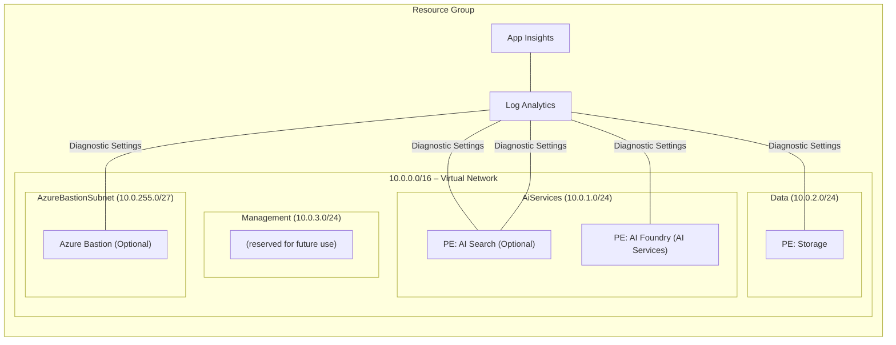

# Architecture

This document describes the Azure resources deployed by [infra/main.bicep](infra/main.bicep), the Azure Verified Modules (AVM) used, and the network topology when deployed with network isolation.

If this solution accelerator is deployed without network isolation, the networking resources are not deployed and public endpoints are enabled for all PaaS services.

## Zero-trust with Network Isolation

The following diagram illustrates the architecture of the Azure resources deployed when network isolation is enabled. The solution accelerator is deployed in a single resource group, and all resources are deployed in a single virtual network with private endpoints. The virtual network is segmented into multiple subnets to enable granular network security and future scalability.

### Zero-trust high‑Level Architecture

| Layer                   | Resource                                 | AVM Reference                                                                                                                                        |
|-------------------------|------------------------------------------|------------------------------------------------------------------------------------------------------------------------------------------------------|
| Management & Monitoring | Log Analytics Workspace                  | [avm/res/operational-insights/workspace](https://github.com/Azure/bicep-registry-modules/tree/main/modules/operational-insights/workspace) |
|                         | Application Insights                     | [avm/res/insights/component](https://github.com/Azure/bicep-registry-modules/tree/main/modules/insights/component)                      |
| Core Networking         | Virtual Network                          | [avm/res/network/virtual-network](https://github.com/Azure/bicep-registry-modules/tree/main/modules/network/virtual-network)                |
|                         | Private DNS Zones (Storage, AI Search, AI Foundry) | [avm/res/network/private-dns-zone](https://github.com/Azure/bicep-registry-modules/tree/main/modules/network/private-dns-zone)               |
| Data                    | Storage Account (PE)                     | [avm/res/storage/storage-account](https://github.com/Azure/bicep-registry-modules/tree/main/modules/storage/storage-account)                |
|                         | Azure AI Search (PE)                     | [avm/res/search/search-service](https://github.com/Azure/bicep-registry-modules/tree/main/modules/search/search-service)                 |
| AI Services             | Azure AI Foundry (PE)                    | [avm/res/cognitive-services/account](https://github.com/Azure/bicep-registry-modules/tree/main/modules/cognitive-services/account)                        |
| Access (optional)       | Azure Bastion Host                       | [avm/res/network/bastion-host](https://github.com/Azure/bicep-registry-modules/tree/main/modules/network/bastion-host)                   |

> **PE** – deployed with a private endpoint; public network access disabled where supported.

### Virtual Network

The virtual network is segmented into multiple subnets to enable granular network security and future scalability. The current subnet structure is as follows:

| Subnet              | Address‑Prefix    | Purpose                                                    |
|---------------------|------------------|-------------------------------------------------------------|
| `Default`           | 10.0.0.0/24      | Reserved for future use (not used)                          |
| `AiServices`        | 10.0.1.0/24      | AI Foundry Hub, AI Search & AI Services private endpoints   |
| `Data`              | 10.0.2.0/24      | Key Vault, Storage private endpoints                        |
| `Management`        | 10.0.3.0/24      | Reserved for future management endpoints (currently unused) |
| `AzureBastionSubnet`| 10.0.255.0/27    | Bastion gateway (optional)                                  |

> **Note:** The `Management` subnet is currently empty and reserved for future use (e.g., private endpoints for monitoring or management).

All private endpoints are placed in their dedicated subnets, isolating traffic and enabling granular NSG rules if required.

### Logical Network Topology

The following diagram illustrates the logical network topology of the deployed resources. The `azd-env-name` tag is applied to all resources for traceability.

```mermaid
flowchart RL
    subgraph RG["Resource Group"]
        subgraph VNet["10.0.0.0/16 – Virtual Network"]
            direction RL
            subgraph S1["AiServices (10.0.1.0/24)"]
                PE_Foundry["PE: AI Foundry (AI Services)"]    
                PE_Search["PE: AI Search (Optional)"]
            end
            subgraph S2["Data (10.0.2.0/24)"]
                PE_Storage["PE: Storage"]
            end
            subgraph S3["Management (10.0.3.0/24)"]
                EmptyMgmt["(reserved for future use)"]
            end
            subgraph S5["AzureBastionSubnet (10.0.255.0/27)"]
                Bastion["Azure Bastion (Optional)"]
            end
        end
        LA["Log Analytics"]
        AI["App Insights"]
    end

    LA ---|Diagnostic Settings| PE_Search
    LA ---|Diagnostic Settings| PE_Foundry
    LA ---|Diagnostic Settings| PE_Search
    LA ---|Diagnostic Settings| PE_Storage
    LA ---|Diagnostic Settings| Bastion
    AI --- LA
```

## Without Network Isolation

The following diagram illustrates the architecture of the Azure resources deployed when network isolation is disabled and public endpoints are enabled for all PaaS services. The solution accelerator is deployed in a single resource group, and not.

### Without Network Isolation High-Level Architecture

| Layer                   | Resource                                                                 | AVM Reference                                                                                                   |
|-------------------------|--------------------------------------------------------------------------|-----------------------------------------------------------------------------------------------------------------|
| Management & Monitoring | Log Analytics Workspace             | [avm/res/operational-insights/workspace](https://github.com/Azure/bicep-registry-modules/tree/main/modules/operational-insights/workspace) |
|                         | Application Insights                | [avm/res/insights/component](https://github.com/Azure/bicep-registry-modules/tree/main/modules/insights/component) |
| Data                    | Storage Account                     | [avm/res/storage/storage-account](https://github.com/Azure/bicep-registry-modules/tree/main/modules/storage/storage-account) |
|                         | Azure AI Search                     | [avm/res/search/search-service](https://github.com/Azure/bicep-registry-modules/tree/main/modules/search/search-service) |
| AI Foundry              | Azure AI Foundry (AI Services)      | [avm/res/cognitive-services/account](https://github.com/Azure/bicep-registry-modules/tree/main/modules/cognitive-services/account) |
|                         | Azure AI Foundry Project            | Not currently supported by AVM                                                                                                       |

> [!IMPORTANT]
> The Azure AI Foundry v2 resource structure is not currently supported by Azure Verified Modules (AVM), but once it is, this solution accelerator will be updated to use it.
>
> The Azure AI Foundry v1 (Hub and Project) resources are no longer deployed by this solution accelerator, and instead the Azure AI Foundry [Microsoft.CognitiveServices/accounts@2025-04-01-preview](https://learn.microsoft.com/azure/templates/microsoft.cognitiveservices/2025-04-01-preview/accounts) resource is used to provide the Foundry and AI Services capabilities. The [projects](https://learn.microsoft.com/azure/templates/microsoft.cognitiveservices/2025-04-01-preview/accounts/projects) child resource is used to create the AI Foundry Project, which is the equivalent of the Azure AI Foundry Project resource.

## Security & Best Practices

1. **Managed Identities** – API key authentication is not used. All resources use managed identities to authenticate to other Azure services.
1. **Centralised Logging** – Diagnostic settings forward metrics/logs to Log Analytics.
1. **Tagging** – Every resource inherits the `azd-env-name` tag for traceability.
1. **Azure Verified Modules** – All resources are deployed using [Azure Verified Modules (AVM)](https://aka.ms/avm).
