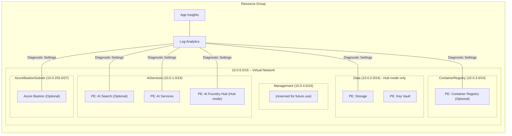

# Architecture

This document describes the Azure resources deployed by [infra/main.bicep](../infra/main.bicep), the Azure Verified Modules (AVM) used, and the network topology when deployed with network isolation.

The solution accelerator supports two different project modes:

- **Hub Mode**: Traditional ML workspace-based architecture with full ML capabilities
- **Foundry Mode**: Streamlined AI Services-based architecture focused on AI Foundry capabilities

See [Project Modes](DEPLOYMENT_MODES.md) for detailed comparison and configuration options.

## Hub Mode Architecture

Hub mode deploys the traditional Azure AI Foundry architecture using Azure Machine Learning workspaces configured as hubs and projects.

### Hub Mode with Zero-trust Network Isolation

The following diagram illustrates the Hub mode architecture when network isolation is enabled:

#### Hub Mode Zero-trust Architecture Components

| Layer                   | Resource                                 | AVM Reference                                                                                                                                        |
|-------------------------|------------------------------------------|------------------------------------------------------------------------------------------------------------------------------------------------------|
| Management & Monitoring | Log Analytics Workspace                  | [avm/res/operational-insights/workspace](https://github.com/Azure/bicep-registry-modules/tree/main/modules/operational-insights/workspace)           |
|                         | Application Insights                     | [avm/res/insights/component](https://github.com/Azure/bicep-registry-modules/tree/main/modules/insights/component)                                   |
| Core Networking         | Virtual Network                          | [avm/res/network/virtual-network](https://github.com/Azure/bicep-registry-modules/tree/main/modules/network/virtual-network)                         |
|                         | Private DNS Zones (Key Vault, Storage, Container Registry, AI Search, AI Services, Foundry Hub) | [avm/res/network/private-dns-zone](https://github.com/Azure/bicep-registry-modules/tree/main/modules/network/private-dns-zone) |
| Security                | Azure Key Vault (PE)                     | [avm/res/key-vault/vault](https://github.com/Azure/bicep-registry-modules/tree/main/modules/key-vault/vault)                                         |
| Data                    | Storage Account (PE)                     | [avm/res/storage/storage-account](https://github.com/Azure/bicep-registry-modules/tree/main/modules/storage/storage-account)                         |
|                         | Azure AI Search (PE)                     | [avm/res/search/search-service](https://github.com/Azure/bicep-registry-modules/tree/main/modules/search/search-service)                             |
| AI Services             | Azure AI Services (Cognitive) (PE)       | [avm/res/cognitive-services/account](https://github.com/Azure/bicep-registry-modules/tree/main/modules/cognitive-services/account)                   |
|                         | Azure AI Foundry Hub (ML Workspace) (PE) | [avm/res/machine-learning-services/workspace](https://github.com/Azure/bicep-registry-modules/tree/main/modules/machine-learning-services/workspace) |
| Containers (Optional)   | Azure Container Registry (PE)            | [avm/res/container-registry/registry](https://github.com/Azure/bicep-registry-modules/tree/main/modules/container-registry/registry)                 |
| Access (optional)       | Azure Bastion Host                       | [avm/res/network/bastion-host](https://github.com/Azure/bicep-registry-modules/tree/main/modules/network/bastion-host)                               |

> **PE** – deployed with a private endpoint; public network access disabled where supported.

### Hub Mode without Network Isolation

When network isolation is disabled in Hub mode, the networking resources are not deployed and public endpoints are enabled for all PaaS services:

#### Hub Mode Public Architecture Components

| Layer                   | Resource                                 | AVM Reference                                                                                                                                        |
|-------------------------|------------------------------------------|------------------------------------------------------------------------------------------------------------------------------------------------------|
| Management & Monitoring | Log Analytics Workspace                  | [avm/res/operational-insights/workspace](https://github.com/Azure/bicep-registry-modules/tree/main/modules/operational-insights/workspace)           |
|                         | Application Insights                     | [avm/res/insights/component](https://github.com/Azure/bicep-registry-modules/tree/main/modules/insights/component)                                   |
| Security                | Azure Key Vault                         | [avm/res/key-vault/vault](https://github.com/Azure/bicep-registry-modules/tree/main/modules/key-vault/vault)                                         |
| Data                    | Storage Account                          | [avm/res/storage/storage-account](https://github.com/Azure/bicep-registry-modules/tree/main/modules/storage/storage-account)                         |
|                         | Azure AI Search                          | [avm/res/search/search-service](https://github.com/Azure/bicep-registry-modules/tree/main/modules/search/search-service)                             |
| AI Services             | Azure AI Services (Cognitive)            | [avm/res/cognitive-services/account](https://github.com/Azure/bicep-registry-modules/tree/main/modules/cognitive-services/account)                   |
|                         | Azure AI Foundry Hub (ML Workspace)      | [avm/res/machine-learning-services/workspace](https://github.com/Azure/bicep-registry-modules/tree/main/modules/machine-learning-services/workspace) |
| Containers (Optional)   | Azure Container Registry                 | [avm/res/container-registry/registry](https://github.com/Azure/bicep-registry-modules/tree/main/modules/container-registry/registry)                 |

## Project Mode Architecture

Project mode deploys a streamlined architecture using Azure AI Services accounts with project management capabilities, reducing dependencies and complexity.

### Project Mode with Zero-trust Network Isolation

The following diagram illustrates the Project mode architecture when network isolation is enabled:

> **Note**: Project mode diagrams are not yet available. The architecture follows the same network topology as Hub mode but with fewer resources (no Key Vault, Storage Account).

#### Project Mode Zero-trust Architecture Components

| Layer                   | Resource                                 | AVM Reference                                                                                                                                        |
|-------------------------|------------------------------------------|------------------------------------------------------------------------------------------------------------------------------------------------------|
| Management & Monitoring | Log Analytics Workspace                  | [avm/res/operational-insights/workspace](https://github.com/Azure/bicep-registry-modules/tree/main/modules/operational-insights/workspace)           |
|                         | Application Insights                     | [avm/res/insights/component](https://github.com/Azure/bicep-registry-modules/tree/main/modules/insights/component)                                   |
| Core Networking         | Virtual Network                          | [avm/res/network/virtual-network](https://github.com/Azure/bicep-registry-modules/tree/main/modules/network/virtual-network)                         |
|                         | Private DNS Zones (AI Search, AI Services) | [avm/res/network/private-dns-zone](https://github.com/Azure/bicep-registry-modules/tree/main/modules/network/private-dns-zone)                    |
| Data                    | Azure AI Search (PE)                     | [avm/res/search/search-service](https://github.com/Azure/bicep-registry-modules/tree/main/modules/search/search-service)                             |
| AI Services             | Azure AI Services with Project Management (PE) | [avm/res/cognitive-services/account](https://github.com/Azure/bicep-registry-modules/tree/main/modules/cognitive-services/account)                |
| Containers (Optional)   | Azure Container Registry (PE)            | [avm/res/container-registry/registry](https://github.com/Azure/bicep-registry-modules/tree/main/modules/container-registry/registry)                 |
| Access (optional)       | Azure Bastion Host                       | [avm/res/network/bastion-host](https://github.com/Azure/bicep-registry-modules/tree/main/modules/network/bastion-host)                               |

> **PE** – deployed with a private endpoint; public network access disabled where supported.

### Project Mode without Network Isolation

When network isolation is disabled in Project mode:

> **Note**: Project mode diagrams are not yet available. The architecture follows the same approach as Hub mode but with fewer resources (no Key Vault, Storage Account).

#### Project Mode Public Architecture Components

| Layer                   | Resource                                  | AVM Reference                                                                                                                                        |
|-------------------------|-------------------------------------------|------------------------------------------------------------------------------------------------------------------------------------------------------|
| Management & Monitoring | Log Analytics Workspace                   | [avm/res/operational-insights/workspace](https://github.com/Azure/bicep-registry-modules/tree/main/modules/operational-insights/workspace)           |
|                         | Application Insights                      | [avm/res/insights/component](https://github.com/Azure/bicep-registry-modules/tree/main/modules/insights/component)                                   |
| Data                    | Azure AI Search                           | [avm/res/search/search-service](https://github.com/Azure/bicep-registry-modules/tree/main/modules/search/search-service)                             |
| AI Services             | Azure AI Services with Project Management | [avm/res/cognitive-services/account](https://github.com/Azure/bicep-registry-modules/tree/main/modules/cognitive-services/account)                  |
| Containers (Optional)   | Azure Container Registry                  | [avm/res/container-registry/registry](https://github.com/Azure/bicep-registry-modules/tree/main/modules/container-registry/registry)                 |

## Network Topology (Zero-trust Mode)

When network isolation is enabled, both Hub and Project modes share the same virtual network structure but with different resource deployments.

### Virtual Network Subnets

The virtual network is segmented into multiple subnets to enable granular network security and future scalability:

| Subnet              | Address‑Prefix    | Purpose                                                    |
|---------------------|------------------|-------------------------------------------------------------|
| `Default`           | 10.0.0.0/24      | Reserved for future use (not used)                          |
| `AiServices`        | 10.0.1.0/24      | AI Foundry Hub, AI Search & AI Services private endpoints   |
| `Data`              | 10.0.2.0/24      | Key Vault, Storage private endpoints (Hub mode only)        |
| `ContainerRegistry` | 10.0.3.0/24      | Azure Container Registry private endpoints (optional)       |
| `Management`        | 10.0.4.0/24      | Reserved for future management endpoints (currently unused) |
| `AzureBastionSubnet`| 10.0.255.0/27    | Bastion gateway (optional)                                  |

> **Note:** The `Management` subnet is currently empty and reserved for future use (e.g., private endpoints for monitoring or management).
> In Project mode, the `Data` subnet is not used since Key Vault and Storage Account are not deployed.

All private endpoints are placed in their dedicated subnets, isolating traffic and enabling granular NSG rules if required.

### Logical Network Topology

The following diagram illustrates the logical network topology of the deployed resources. The `azd-env-name` tag is applied to all resources for traceability.

## Mode Comparison

| Aspect | Hub Mode | Project Mode |
|--------|----------|--------------|
| **Core Resource** | ML Workspace Hub | AI Services Account |
| **Required Dependencies** | Storage, Key Vault, App Insights | App Insights only |
| **Network Complexity** | Higher (more private endpoints) | Lower (fewer private endpoints) |
| **Cost** | Higher due to additional resources | Lower, optimized resource count |
| **Project Management** | ML Workspace Projects | CognitiveServices Projects |
| **Use Case** | Full ML/AI capabilities | AI Foundry focused features |

## Security & Best Practices

1. **Managed Identities** – API key authentication is not used. All resources use managed identities to authenticate to other Azure services.
1. **Centralized Logging** – Diagnostic settings forward metrics/logs to Log Analytics.
1. **Tagging** – Every resource inherits the `azd-env-name` tag for traceability.
1. **Azure Verified Modules** – All resources are deployed using [Azure Verified Modules (AVM)](https://aka.ms/avm).
1. **Network Isolation** – When enabled, all PaaS services use private endpoints and disable public access.
1. **Zero Trust** – Default deployment follows Microsoft's Zero Trust security model and Secure Future Initiative.
