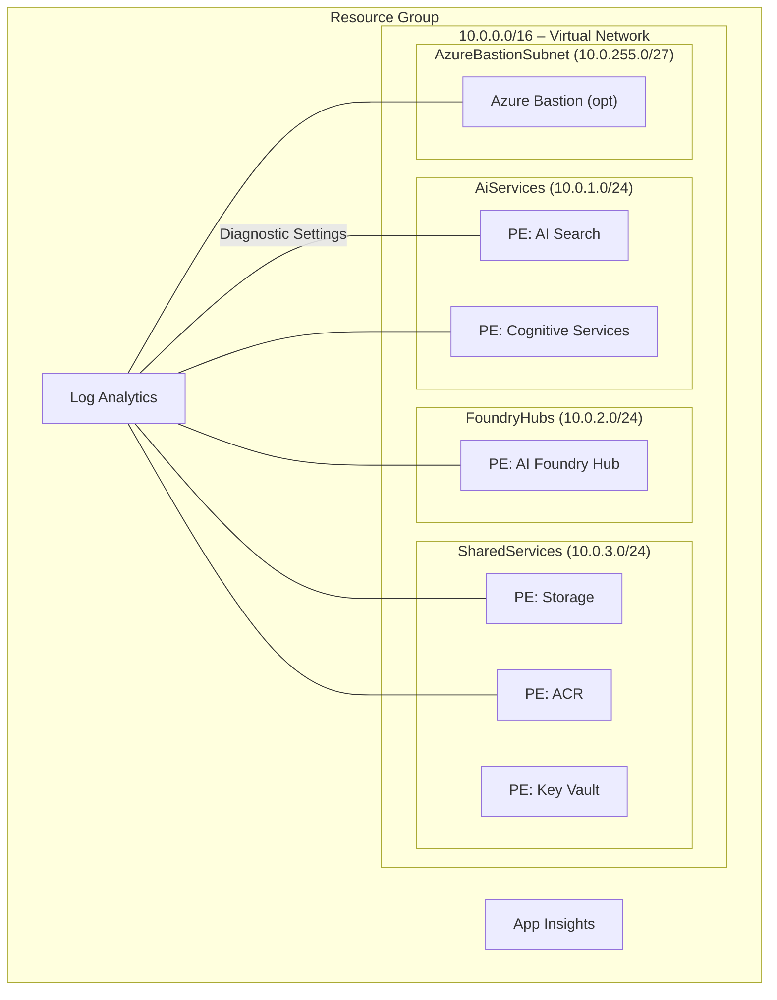

# Architecture

This document describes the Azure resources deployed by [infra/main.bicep](infra/main.bicep), the Azure Verified Modules (AVM) used, and the network topology when deployed with network isolation.

If this solution accelerator is deployed without network isolation, the networking resources are not deployed and public endpoints are enabled for all PaaS services.

## Netowrk Isolation Mode

### High‑Level Architecture

| Layer | Resource | AVM Reference |
|-------|----------|---------------|
| Management & Monitoring | Log Analytics Workspace | [avm/res/operational-insights/workspace](https://github.com/Azure/bicep-registry-modules/tree/main/modules/operational-insights/workspace) |
|  | Application Insights | [avm/res/insights/component](https://github.com/Azure/bicep-registry-modules/tree/main/modules/insights/component) |
| Core Networking | Virtual Network | [avm/res/network/virtual-network](https://github.com/Azure/bicep-registry-modules/tree/main/modules/network/virtual-network) |
|  | Private DNS Zones (Key Vault, Storage, ACR, Search, Cognitive Services, ML) | [avm/res/network/private-dns-zone](https://github.com/Azure/bicep-registry-modules/tree/main/modules/network/private-dns-zone) |
| Security | Azure Key Vault (PE) | [avm/res/key-vault/vault](https://github.com/Azure/bicep-registry-modules/tree/main/modules/key-vault/vault) |
| Data | Storage Account (PE) | [avm/res/storage/storage-account](https://github.com/Azure/bicep-registry-modules/tree/main/modules/storage/storage-account) |
|  | Azure AI Search (PE) | [avm/res/search/search-service](https://github.com/Azure/bicep-registry-modules/tree/main/modules/search/search-service) |
| AI Services | Azure AI Services (Cognitive) (PE) | [avm/res/cognitive-services/account](https://github.com/Azure/bicep-registry-modules/tree/main/modules/cognitive-services/account) |
|  | Azure AI Foundry Hub (ML Workspace) (PE) | [avm/res/machine-learning-services/workspace](https://github.com/Azure/bicep-registry-modules/tree/main/modules/machine-learning-services/workspace) |
| Containers (Optional) | Azure Container Registry (PE) | [avm/res/container-registry/registry](https://github.com/Azure/bicep-registry-modules/tree/main/modules/container-registry/registry) |
| Access (optional) | Azure Bastion Host | [avm/res/network/bastion-host](https://github.com/Azure/bicep-registry-modules/tree/main/modules/network/bastion-host) |

> **PE** – deployed with a private endpoint; public network access disabled where supported.

### Virtual Network

| Subnet | Address‑Prefix | Purpose |
|--------|----------------|---------|
| `Default` | 10.0.0.0/24 | Reserved |
| `AiServices` | 10.0.1.0/24 | AI Search & Cognitive Services private endpoints |
| `FoundryHubs` | 10.0.2.0/24 | Azure AI Foundry Hub private endpoint |
| `SharedServices` | 10.0.3.0/24 | Key Vault, Storage, ACR private endpoints |
| `AzureBastionSubnet` | 10.0.255.0/27 | Bastion gateway (optional) |

All private endpoints are placed in their dedicated subnets, isolating traffic and enabling granular NSG rules if required.

#### Logical Network Topology

The following diagram illustrates the logical network topology of the deployed resources. The `azd-env-name` tag is applied to all resources for traceability.

## Security & Best Practices

1. **Managed Identities** – API key authentication is not used. All resources use managed identities to authenticate to other Azure services.
1. **Centralised Logging** – Diagnostic settings forward metrics/logs to Log Analytics.
1. **Tagging** – Every resource inherits the `azd-env-name` tag for traceability.
1. **Azure Verified Modules** – All resources are deployed using [Azure Verified Modules (AVM)](https://aka.ms/avm).
