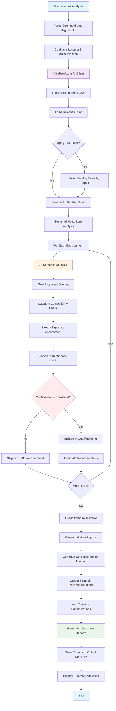

# Initiative Analyzer

A Python application that takes a CSV list of backlog items and analyzes them using Azure AI Foundry's language models. It loops through each backlog item and attempts to associate it with existing initiatives based on semantic analysis and goal alignment. When backlog items are associated with initiatives above a specified confidence threshold, it provides deeper analysis of how those backlog items will impact the initiatives and outputs detailed markdown reports.

## Overview

This sample demonstrates how to use the Azure AI Projects SDK to create an intelligent initiative analysis agent that:

- Analyzes each backlog item individually using a language model
- Associates backlog items with existing initiatives using semantic analysis and goal alignment
- Applies confidence thresholds to determine which associations to include
- Provides deep impact analysis of how backlog items will affect associated initiatives
- Generates comprehensive markdown reports organized by initiative
- Uses function tool calling to perform sophisticated initiative matching and impact assessment

## Prerequisites

- Python 3.8 or later
- Azure AI Foundry project with a deployed language model (e.g., gpt-4.1, gpt-4.1-mini)
- Access to Azure with appropriate authentication configured

## Installation

1. Navigate to the initiative analyzer directory:

  ```bash
  cd src/samples/python/azure_ai_inference/initiative_analyzer
  ```

1. Install the required dependencies:

  ```bash
  pip install -r requirements.txt
  ```

## Configuration

Set the following environment variables:

- `PROJECT_ENDPOINT` (required): Your Azure AI Foundry project endpoint URL in the format `https://<project-name>.<region>.api.azureml.ms`
- `MODEL_DEPLOYMENT_NAME` (optional): Name of your deployed language model (defaults to "gpt-4o")
- `VERBOSE_LOGGING` (optional): Logging verbosity level (defaults to "ERROR")

You can also create a `.env` file in this directory:

```env
PROJECT_ENDPOINT=https://your-project.eastus.api.azureml.ms
MODEL_DEPLOYMENT_NAME=gpt-4o
VERBOSE_LOGGING=ERROR
```

## Authentication

This application uses `DefaultAzureCredential` for Azure authentication, which automatically selects the most appropriate credential source:

- Azure CLI login (`az login`)
- Managed Identity (when running on Azure)
- Visual Studio Code Azure Account extension
- Environment variables (AZURE_CLIENT_ID, AZURE_CLIENT_SECRET, AZURE_TENANT_ID)

## Initiative Analysis Workflow

The initiative analyzer uses an AI-driven workflow to systematically evaluate each backlog item against available initiatives and provide comprehensive impact analysis. The process focuses on building strong associations between backlog items and initiatives, then generating detailed reports on how the completion of backlog items will advance organizational initiatives.

> [!NOTE]
> There is a detailed description of the initiative analysis workflow in the [Initiative Analysis Workflow Detail](#initiative-analysis-workflow-detail) section.

## Usage

## Input

### Backlog CSV Format

- `category`: The high-level category of the backlog item
- `initiative`: An existing initiative for the backlog item (optional)
- `title`: Title of the backlog item
- `goal`: The goal or expected outcome of the backlog item
- `stream`: The stream or team responsible for the backlog item
- Optional columns for each half-year (e.g., `25 H1`, `25 H2`, etc.) to indicate when the item is planned for implementation

#### Example Backlog CSV

```csv
category,initiative,title,goal,stream,25 H1,25 H2,26 H1,26 H2,27 H1,27 H2,28+
"User Experience","Improve onboarding","Simplify onboarding process","Reduce time to onboard new users","Product Team",1,1,0,0,0,0,0
```

### Initiatives CSV Format

- `area`: The area of the initiative (e.g., "Developer Excellence")
- `title`: Title of the initiative
- `details`: Detailed description of the initiative
- `description`: Additional information about the initiative
- `kpi`: Key Performance Indicators for the initiative
- `current_state`: Current status of the initiative
- `solutions`: Proposed solutions for the initiative

#### Example Initiatives CSV

```csv
area,title,details,description,kpi,current_state,solutions
"Developer Excellence","Improve developer onboarding","Streamline the onboarding process for new developers using GitHub Copilot","Create a comprehensive onboarding guide for GitHub Copilot","Time to onboard new developers","GitHub Copilot available, but low adoption","GitHub Copilot bootcamp, workshops, and documentation"
```

### Output

The analyzer generates a comprehensive set of initiative reports organized in the output folder. Each initiative that has associated backlog items (meeting the confidence threshold) gets its own markdown file with detailed impact analysis:

#### Initiative Report Format

Each initiative report follows this structure:

```md
---
area: [The area of the initiative (e.g., "Developer Excellence")]
title: [The title of the initiative]
confidence_threshold: [The minimum confidence threshold used for associations]
total_associated_items: [Number of backlog items associated with this initiative]
---

# [Initiative Title]

## Initiative Overview

**Area:** [Initiative Area]
**Current Status:** [Current state of the initiative]

[Detailed description of the initiative]

## Key Performance Indicators

[Key Performance Indicators for the initiative]

## Proposed Solutions

[Proposed solutions for the initiative]

## Associated Backlog Items

The following backlog items have been associated with this initiative based on semantic analysis and goal alignment:

| Title | Goal | Category | Stream | Timeline | Confidence | Impact Analysis |
|-------|------|----------|--------|----------|------------|-----------------|
| [Backlog Item Title] | [Item Goal] | [Category] | [Responsible Stream] | [Implementation Timeline] | [XX%] | [Detailed impact analysis] |

## Collective Impact Assessment

[AI-generated analysis of how all associated backlog items will work together to advance this initiative]

## Strategic Recommendations

[AI-generated recommendations for maximizing the success of this initiative based on the associated backlog items]

## Timeline and Resource Considerations

[Analysis of timeline alignment and resource implications across all associated backlog items]
```

#### Output Organization

- **One file per initiative**: Each initiative with associated backlog items gets a dedicated markdown file
- **File naming**: Initiative files are named using the initiative title (sanitized for filesystem compatibility)
- **No associations**: Initiatives without any qualifying backlog associations are not included in the output
- **Summary statistics**: Each report includes metadata about the number of associated items and confidence threshold used

### Initiative Analysis

Analyze backlog items and associate them with initiatives, generating detailed impact reports:

```bash
python initiative_analyzer.py --backlog backlog.csv --initiatives initiatives.csv --output initiative_reports/
```

#### Confidence Threshold Control

You can control which associations are included in the final reports by setting a confidence threshold:

```bash
# Only include associations with 70% or higher confidence
python initiative_analyzer.py --backlog backlog.csv --initiatives initiatives.csv --output initiative_reports/ --confidence-threshold 70

# Include more associations with lower threshold (50% or higher)
python initiative_analyzer.py --backlog backlog.csv --initiatives initiatives.csv --output initiative_reports/ --confidence-threshold 50
```

#### Filtering Backlog Items by Title

You can filter which backlog items to process using a regex pattern with the `--filter-title` parameter:

```bash
# Process only items with "onboard" in the title (case-insensitive)
python initiative_analyzer.py --backlog backlog.csv --initiatives initiatives.csv --output initiative_reports/ --filter-title ".*onboard.*"

# Process only items starting with "Mobile"
python initiative_analyzer.py --backlog backlog.csv --initiatives initiatives.csv --output initiative_reports/ --filter-title "^Mobile.*"

# Process items ending with "security"
python initiative_analyzer.py --backlog backlog.csv --initiatives initiatives.csv --output initiative_reports/ --filter-title ".*security$"

# Combine with confidence threshold
python initiative_analyzer.py --backlog backlog.csv --initiatives initiatives.csv --output initiative_reports/ --filter-title "(API|integration)" --confidence-threshold 60
```

**Filter Examples:**

- `.*onboard.*` - Matches any backlog item title containing "onboard" (case-insensitive)
- `^Mobile.*` - Matches backlog item titles starting with "Mobile"
- `.*security$` - Matches backlog item titles ending with "security"
- `(API|integration)` - Matches backlog item titles containing either "API" or "integration"
- `Setup.*automation` - Matches backlog item titles starting with "Setup" and containing "automation"

The filter uses Python's `re` module with case-insensitive matching. Invalid regex patterns will show a clear error message.

**Confidence Threshold Guidelines:**

- `80-100%` - High confidence associations; very strong semantic alignment and goal matching
- `60-79%` - Medium confidence associations; good alignment with some uncertainty
- `40-59%` - Lower confidence associations; potential matches that may need review
- `Below 40%` - Weak associations; typically excluded from reports unless threshold is explicitly lowered

## Code Quality

This implementation follows Python best practices and passes ruff linting checks:

```bash
# Run linting
python -m ruff check backlog_analyzer.py

# Apply automatic fixes
python -m ruff check --fix backlog_analyzer.py

# Format code
python -m ruff format backlog_analyzer.py
```

## Troubleshooting

### Common Issues

1. **Authentication Failed**: Ensure you're logged into Azure CLI (`az login`) or have appropriate credentials configured
2. **Endpoint Not Found**: Verify your PROJECT_ENDPOINT is correct and the project exists
3. **Model Not Available**: Check that your MODEL_DEPLOYMENT_NAME matches a deployed model in your project
4. **Network Issues**: Ensure you have internet connectivity and can reach Azure endpoints

### Debug Logging

To enable debug logging, use the `--verbose` command-line option or set the `VERBOSE_LOGGING` environment variable:

```bash
# Command line option
python initiative_analyzer.py --backlog backlog.csv --initiatives initiatives.csv --output initiative_reports/ --verbose DEBUG

# Environment variable
export VERBOSE_LOGGING=DEBUG  # Linux/Mac
$env:VERBOSE_LOGGING="DEBUG"  # Windows PowerShell
```

Valid logging levels: DEBUG, INFO, WARNING, ERROR, CRITICAL (default: ERROR)

## Dependencies

This implementation requires the following key dependencies:

- **Python 3.8+**
- **azure-ai-projects v1.0.0b12+** - Core Azure AI Foundry SDK
- **azure-identity** - DefaultAzureCredential authentication
- **openai** - Chat completions via Azure OpenAI client
- **argparse** - Command line argument parsing
- **json** - Tool response handling
- **logging** - Configurable verbosity control

## Initiative Analysis Workflow Detail

This section contains a detailed view of the initiative analysis workflow.

### Process Flow Diagram



Here's the detailed process:

### 1. Individual Backlog Item Processing

For each backlog item in the CSV file, the analyzer performs:

#### 1.1 Initiative Association Analysis

- **Semantic Matching**: Compare the backlog item's title, goal, and category with initiative areas, descriptions, and solutions
- **Goal Alignment Scoring**: Evaluate how well the backlog item's stated goal aligns with each initiative's objectives
- **Category Compatibility**: Assess if the backlog item's category semantically matches the initiative's area
- **Stream Expertise**: Consider if the responsible stream has the capacity and expertise for the initiative

#### 1.2 Confidence Threshold Application

- **Association Scoring**: Generate confidence scores (0-100) for each potential initiative match
- **Threshold Filtering**: Only include associations that meet or exceed the specified confidence threshold
- **Primary/Secondary Ranking**: Rank qualifying associations by confidence level to identify primary and secondary initiatives

### 2. Impact Analysis Generation

For each backlog item that successfully associates with one or more initiatives:

#### 2.1 Strategic Impact Assessment

- **Direct Advancement**: Analyze how completing the backlog item will directly advance the associated initiative
- **KPI Impact**: Evaluate the potential effect on the initiative's Key Performance Indicators
- **Timeline Synergy**: Assess how the backlog item's planned timeline aligns with initiative goals
- **Resource Optimization**: Identify opportunities for resource sharing and efficiency gains

#### 2.2 Detailed Impact Modeling

- **Quantitative Analysis**: Where possible, provide measurable impact predictions
- **Qualitative Insights**: Generate narrative analysis of strategic benefits and considerations
- **Risk Assessment**: Identify potential risks, dependencies, or blockers
- **Implementation Recommendations**: Suggest optimal approaches for maximizing initiative advancement

### 3. Report Generation by Initiative

After processing all backlog items, the analyzer generates comprehensive reports:

#### 3.1 Initiative-Centric Organization

- **One Report Per Initiative**: Create individual markdown files for each initiative that has associated backlog items
- **Associated Backlog Summary**: List all backlog items linked to each initiative with their confidence scores
- **Consolidated Impact View**: Provide a unified view of how multiple backlog items will collectively advance the initiative

#### 3.2 Comprehensive Initiative Reports

Each initiative report includes:

- **Initiative Overview**: Full context including area, description, KPIs, and current state
- **Associated Backlog Items**: Detailed table of linked backlog items with impact analysis
- **Collective Impact Assessment**: Analysis of how all associated backlog items will work together
- **Strategic Recommendations**: AI-generated insights for maximizing initiative success
- **Timeline and Resource Planning**: Integrated view of when and how backlog items support the initiative

### 4. Quality Assurance and Validation

- **Confidence Validation**: Ensure all included associations meet the specified threshold
- **Consistency Checks**: Verify that impact analysis aligns with association confidence scores
- **Completeness Verification**: Confirm all qualifying backlog items are properly linked and analyzed
- **Output Quality**: Ensure all generated markdown reports are well-formatted and comprehensive

### 5. Organizational Intelligence

The final output provides:

- **Strategic Alignment View**: Clear picture of how backlog work supports organizational initiatives
- **Priority Guidance**: Data-driven insights for backlog prioritization based on initiative impact
- **Resource Planning**: Understanding of how backlog completion advances strategic goals
- **Gap Analysis**: Identification of initiatives that lack supporting backlog items

This workflow ensures that every backlog item is systematically evaluated against the strategic context, with only high-confidence associations included in the final analysis, resulting in reliable, actionable insights for initiative advancement and backlog prioritization.

## Implementation Notes

- Uses Azure AI Projects SDK with AIProjectClient.inference.get_azure_openai_client()
- Implements modular initiative association architecture with separate modules for semantic analysis
- Implements function tool calling for sophisticated initiative matching and impact assessment
- Applies configurable confidence thresholds to control association quality
- Generates comprehensive initiative-centric reports with collective impact analysis
- Follows Azure SDK security best practices
- Compatible with tool-capable AI models (GPT-4, GPT-4o, etc.)
- Supports Azure AI Foundry project deployments
- Quiet-by-default logging (ERROR level) with configurable verbosity
- Extensible design allows easy addition of new analytical tools and report formats
